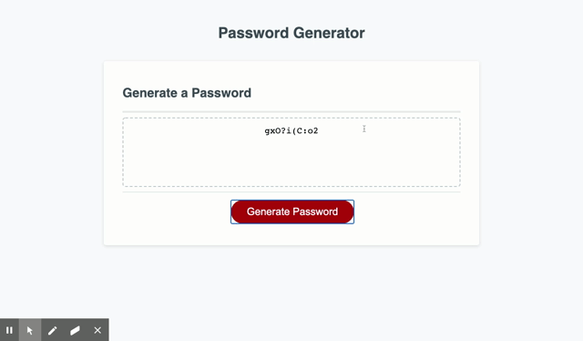

# passwordgenerator

To obtain a passord, the user has to click on **Generate Password** then they will be promt with a series of questions asking about the length of their passord and weather they want lower/uppercase and special characters. Then the app woulg generate a password for them.

# Technologie used

**HTML**

**CSS**

**Javascript**

# Demo

# Links

[deployed website](https://snubia.github.io/passwordgenerator/)

[Github repository](https://github.com/Snubia/passwordgenerator.git)

# for feedback, contributions or questions

[Linkedin](https://www.linkedin.com/in/sandrine-nubia-975aa2172/)

[Linkedin](https://www.linkedin.com/in/sandrine-nubia-975aa2172/)